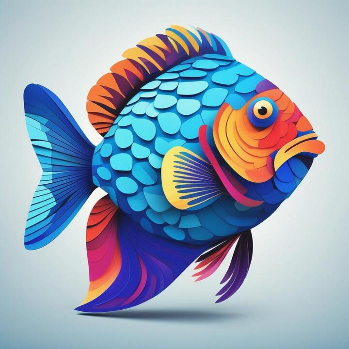

<div align="center">
  <!-- Illustration of an underwater haven where the sand is etched with bright, neon circuit motifs. Schools of robot-like fish with a metallic luster navigate amidst fluorescent marine plants. A radiant shell opens, standing out as a guiding light for the marine tech realm. -->
  
  <h1><code>fish</code></h1>
</div>

My [Fish](https://github.com/fish-shell/fish-shell) shell functions, packaged as a [Fisher](https://github.com/jorgebucaran/fisher) plugin. Originally part of my [dotfiles](https://github.com/adamelliotfields/dotfiles).

## Installation

```sh
# add to ~/.config/fish/fish_plugins and install
fisher install adamelliotfields/fish@main

# install or update if already in fish_plugins
fisher update
```

## Functions

<!-- It's handling relative URLs weird -->
- [`chat`](https://github.com/adamelliotfields/fish/blob/main/functions/chat.fish): OpenAI chat CLI
- [`dracula`](https://github.com/adamelliotfields/fish/blob/main/functions/dracula.fish): Toggle Dracula Pro theme in Hyper terminal
- [`fio`](https://github.com/adamelliotfields/fish/blob/main/functions/fio.fish): File.io CLI
- [`format`](https://github.com/adamelliotfields/fish/blob/main/functions/format.fish): Display a number in various formats
- [`gituser`](https://github.com/adamelliotfields/fish/blob/main/functions/gituser.fish): Update Git config with email address and corresponding GPG key
- [`google`](https://github.com/adamelliotfields/fish/blob/main/functions/google.fish): Open different Google pages from the terminal
- [`mkcd`](https://github.com/adamelliotfields/fish/blob/main/functions/mkcd.fish): Create a directory and change to it
- [`nvm`](https://github.com/adamelliotfields/fish/blob/main/functions/nvm.fish): Node Version Manager
- [`octal`](https://github.com/adamelliotfields/fish/blob/main/functions/octal.fish): Show octal permissions for a file
- [`postgresql`](https://github.com/adamelliotfields/fish/blob/main/functions/postgresql.fish): Run a Postgres container
- [`pypi`](https://github.com/adamelliotfields/fish/blob/main/functions/pypi.fish): Search PyPI for package info
- [`redis`](https://github.com/adamelliotfields/fish/blob/main/functions/redis.fish): Run a Redis container with RedisInsight
- [`spinner`](https://github.com/adamelliotfields/fish/blob/main/functions/spinner.fish): Ora-like loading spinner
- [`ubuntu`](https://github.com/adamelliotfields/fish/blob/main/functions/ubuntu.fish): Run an Ubuntu container
- [`up`](https://github.com/adamelliotfields/fish/blob/main/functions/up.fish): Move up $n$ directories

## Inspiration

- [alexanderepstein/bash-snippets](https://github.com/alexanderepstein/Bash-Snippets)
